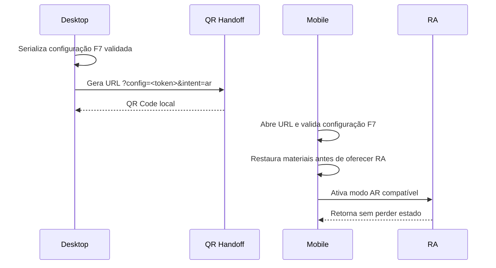

# Contrato de RA e handoff por QR

Status: contrato operacional v1, alinhado à F7.

## Invariante principal

Desktop, mobile e RA representam a mesma configuração canônica: mesmo ID, versão e hash de geometria e os mesmos assignments por `surface_id`. Nenhum modo reconstrói estado a partir de nomes visuais.

## Payload e handoff

O objeto validado por `configuration.schema.json` continua sendo a única entrada de domínio. A F7 definiu a representação compartilhável atual como um token Base64URL validado, transportado no mesmo URL público do configurador:

```text
https://<host-do-configurador>/?config=<token-f7>&intent=ar
```

`config` contém exclusivamente o contrato público F7. `intent=ar` não altera o payload; apenas informa ao mobile que o usuário veio de um handoff para RA.

A proposta F0 de um `configuration_id` opaco + backend não é usada nesta versão porque a F7 foi implementada sem armazenamento remoto. Se uma futura camada de backend introduzir links curtos, ela deverá resolver para o mesmo payload F7 e manter compatibilidade com os links inline já emitidos.

## Fluxo desktop → mobile → RA



Ao abrir o modo QR, o desktop guarda separadamente câmera e estado efêmero da UI, apresenta uma vista lateral e sobrepõe o QR na composição de tela. O QR **não é aplicado como textura/material da poltrona**. Ao fechar, câmera e painéis são restaurados exatamente ao snapshot anterior. Esse snapshot visual não é enviado ao mobile.

## Fluxo mobile direto

`Ver no ambiente` valida a configuração já hidratada e a compatibilidade antes de iniciar RA. Um link com `intent=ar` restaura a configuração primeiro e então apresenta a ação de RA ou o fallback compatível.

## Modos e requisitos

| Plataforma             | Modo F6              | Obrigação                                                             |
| ---------------------- | -------------------- | --------------------------------------------------------------------- |
| Android com WebXR      | `webxr`              | preservar o Scene Graph runtime, escala e assignments ativos          |
| Android sem WebXR      | fallback no 3D       | nunca abrir silenciosamente asset neutro                              |
| iPhone/iPad compatível | `quick-look`         | usar USDZ gerado pelo `<model-viewer>` a partir do estado configurado |
| Sem RA                 | 3D + instrução clara | preservar configuração, permitir compartilhamento e retorno           |

### Por que Scene Viewer não é usado nesta versão

O configurador altera materiais no Scene Graph em runtime. O modo Scene Viewer transfere/recarrega o URL do modelo original e não preserva essas mutações. Enquanto não existir um pipeline de GLB configurado/baked por sessão, Scene Viewer fica excluído do `ar-modes` para impedir que uma poltrona neutra apareça em lugar da configuração do cliente.

## Escala física e posicionamento

- GLB e derivados usam metro.
- O runtime usa `ar-scale="fixed"`; o produto não oferece escala livre na RA.
- Posicionamento é no piso (`ar-placement="floor"`).
- A dimensão de referência continua sendo o bounding box do manifesto canônico.
- Quick Look/USDZ deve preservar a mesma escala física do GLB.

## Segurança e validação

- Rejeitar `schema_version` desconhecida.
- Rejeitar geometria, hash, superfície ou material incompatível.
- Validar o token F7 antes de restaurar qualquer material.
- URL/QR não contém metadata privada, fornecedor, custo ou credenciais.
- Um `config` explícito inválido abre o baseline e não reutiliza silenciosamente storage antigo.
- QR é gerado localmente; nenhum serviço externo recebe a configuração.
- `Permissions-Policy` autoriza `xr-spatial-tracking` apenas para o próprio origin.

## Critérios de round-trip

1. Serializar uma configuração completa via F7.
2. Gerar URL/QR da configuração corrente.
3. Abrir a URL em nova sessão mobile.
4. Validar e restaurar os mesmos assignments antes da ação de RA.
5. Confirmar que fechar o QR no desktop restaura câmera/UI e não altera materiais.
6. Confirmar escala e materiais em Android e iPhone físicos.
7. Retornar ao configurador mantendo o estado.

A automação de F6 cobre 1–5 e estados de compatibilidade. O gate físico em Android e iPhone permanece obrigatório na F9.
