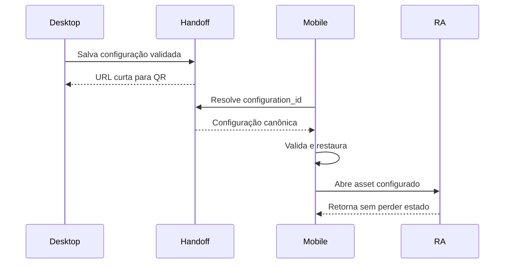

# Contrato de RA e handoff por QR

Status: contrato v1 proposto para aprovação no gate F0.

## Invariante principal

Desktop, mobile e RA representam a mesma configuração canônica: mesmo ID,
versão e hash de geometria e os mesmos assignments por `surface_id`. Nenhum modo
reconstrói estado a partir de nomes visuais.

## Payload

O objeto validado por `configuration.schema.json` é a única entrada de domínio.
O QR transporta uma URL HTTPS curta com `configuration_id` opaco, por exemplo:

```text
https://configurador.k-arv.com/c/550e8400-e29b-41d4-a716-446655440000?intent=ar
```

O JSON completo não deve ser exposto no QR. O mobile resolve o ID, valida schema,
geometria, superfícies e materiais e só então restaura a poltrona. O endpoint e
armazenamento serão definidos na F7; a F6 deve consumir o mesmo contrato.

## Fluxo desktop → mobile → RA



Ao abrir o modo QR, o desktop guarda separadamente câmera e estado efêmero da
UI, apresenta a vista lateral e compõe o QR sem alterar materiais. Ao fechar,
restaura exatamente o snapshot visual anterior. Esse snapshot não é enviado ao
mobile.

## Fluxo mobile direto

`Ver no meu ambiente` valida a configuração corrente e a compatibilidade antes
de iniciar RA. Dispositivo incompatível recebe fallback explícito e continua no
3D configurado.

## Modos e requisitos

| Plataforma         | Modo preferencial                 | Obrigação                                                           |
| ------------------ | --------------------------------- | ------------------------------------------------------------------- |
| Android compatível | WebXR                             | manter GLB, escala em metros e assignments ativos                   |
| Android sem WebXR  | Scene Viewer ou fallback aprovado | usar asset configurado; nunca abrir poltrona neutra silenciosamente |
| iPhone/iPad        | Quick Look/fluxo iOS aprovado     | gerar ou resolver USDZ que represente a configuração completa       |
| Sem RA             | 3D + instrução clara              | preservar configuração e permitir retorno                           |

Quick Look não pode receber um USDZ neutro quando a configuração contém
materiais distintos. Se o pipeline de asset configurado não estiver pronto, RA
fica indisponível com mensagem controlada; não se declara sucesso parcial.

## Escala física e posicionamento

- GLB e derivados usam metro.
- A dimensão de referência é o bounding box do manifesto canônico.
- O runtime não oferece escala livre do produto.
- Posicionamento usa piso quando a plataforma suporta hit test.
- USDZ deve preservar a mesma escala física do GLB.

## Validação e segurança

- Rejeitar `schema_version` desconhecida.
- Rejeitar geometria, hash, superfície ou material incompatível.
- Nunca confiar em payload sem validação server-side e client-side.
- `configuration_id` deve ser não enumerável e possuir política de expiração.
- URL/QR não contém metadata privada ou credenciais.
- Dados corrompidos retornam ao configurador sem perder a sessão local.

## Critérios de round-trip

1. Serializar uma configuração completa.
2. Restaurá-la em nova sessão e comparar semanticamente assignments.
3. Gerar QR da configuração corrente.
4. Restaurar no mobile antes de oferecer RA.
5. Confirmar escala e materiais em dispositivo real.
6. Retornar ao configurador mantendo o estado.

A automação cobre serialização e restauração; o gate físico em Android e iPhone
permanece obrigatório na F9.
